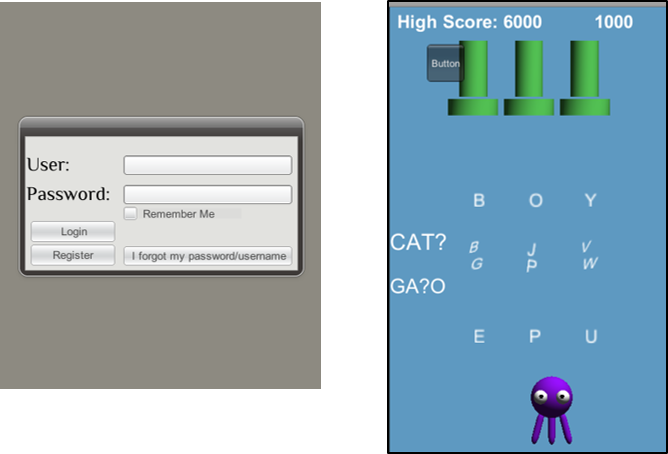
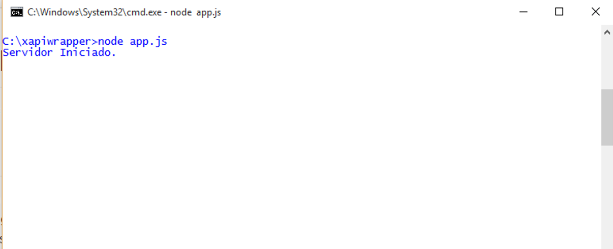

# Lyrics Puzzle
Emision de Badges a traves de Juego desarrollado en Unity bajo el Lenguaje de Programación c#

##Introducción
Es un juego desarrollado en la plataforma Unity, bajo el lenguaje cSharp, Unity como herramienta de desarrollo cuenta con numero de recursos, ofrece gran soporte referente a código y métodos de programación, he utilizado Unity debido a que es una de las herramientas más utilizadas para la creación de videojuegos, es capaz de soportar diversas plataformas como IOS, Android,Windows Phone, Windows para PC, incluso se puede exportar como página web.


##Sinopsis del Juego
La trama del juego se basa en completar palabras en inglés, cuenta con tres niveles y posee tres vidas para pasar cada nivel, dependiendo de la puntuación la cual se basa en tiempo de respuesta y vida mantenida, arrojara una serie de puntos, la cual está condicionada para él envió de Badges, cada palabra en ingles a su vez tiene como referencia la palabra en español. Para obtener puntaje se debe disparar a las letras que no correspondan y si alguna de estas cae al suelo o te toca perderás una vida, la única letra que se debe dejar tocar es la letra correspondiente.





Repositorio de Estandar de de emision de badges a traves de una sola plataforma mediante la combinancion de estandares, los principales para comunicación xAPI (ADL), Openbadges (Mozilla). A continuacion se mostraran tres carpetas en la que cada una tendra un ejemplo de comunicación y emision de badges a traves del estandar propuesto.


##Comunicación Unity Servidor LRS
Para la comunicación desde c# en Unity, se establece a traves de la clase **WWW** desde donde se invoca la url de un Servicio Web, normalmente estos servicios no tienen una funcion autoejecutable de JS, por lo que se debe establecer un servidor de escucha, razon por la cual se ha utilizado la libreria nodejs express **xapiwrapper de ADL**, esta libreria permite realizar un servidor de escucha y podemos configurar el puerto de comunicación, ademas de esto, fue necesario añadirle otras funcionalidades como recepcion de get, y configuración de puerto. EL get es necesario para recibir los parametros o data de los usuarios los cuales se deben enviar desde el juego, el codigo se puede apreciar en app.js, aunque para la ejecucion completa del servidor es necesario la carpeta servernodejs, es necesario tener instalado el servicio nodejs.




###Servidor NODEJS
```javascript
var http = require('http');
var url = require('url');

var adl = require('adl-xapiwrapper');
adl.debugLevel = 'info';
var myconfig = {
    "url":"http://52.88.101.103:8000/xAPI/",
    "auth":{
        "user":"match_game",
        "pass":"ruciomoro"
    }
};
var mylrs = new adl.XAPIWrapper(myconfig);


http.createServer(function(request, response) {

   var query = url.parse(request.url,true).query;
   var mbox = "mailto:"+query.mbox;
   var nameactor = query.nameactor;
  // response.writeHead(200, {'Content-Type': 'text/html'});
   //response.end(variableget);

   var stmt = {
            "actor" : {
                "mbox" : mbox, 
                "name": nameactor, 
                "objectType": "Agent"
            },
            "verb" : {
                "id" : "http://adlnet.gov/expapi/verbs/answered",
                      "display" : {
                        "en-US" : "answered"
                    }
            },

            "object" : {
                "id" : "http://adlnet.gov/expapi/activities/question", 
                "definition": {
                    "name": {
                        "en-US": "actividad"
                    },
                }
            }
        };


  mylrs.sendStatements(stmt, function (err, resp, bdy) {
    adl.log('info', resp.statusCode);
    adl.log('info', bdy);
});

}).listen(8888);
console.log("Servidor Iniciado.");

```

```cSharp
    string url = "http://localhost:8888/?mbox=ingfcoa@gmail.com&&nameactor=alexiunity";
			WWW www = new WWW(url);
			StartCoroutine(WaitForRequest(www));
```

###Instalación y Ejecución del Servidor servernodejs:
1. Instalar nodejs en el Servidor del Juego
2. Descargar la carpeta del servidor servernodejs
3. Abrir la terminal Windows, Mac o Linux (Recomiendo), ubicamos en la carpeta **cd path/servernodejs/**, una vez ubicado en la carpeta ejecutamos el 2do comando **node app.js** podrán apreciar en la terminal un mensaje "Servidor en Ejecucion".

