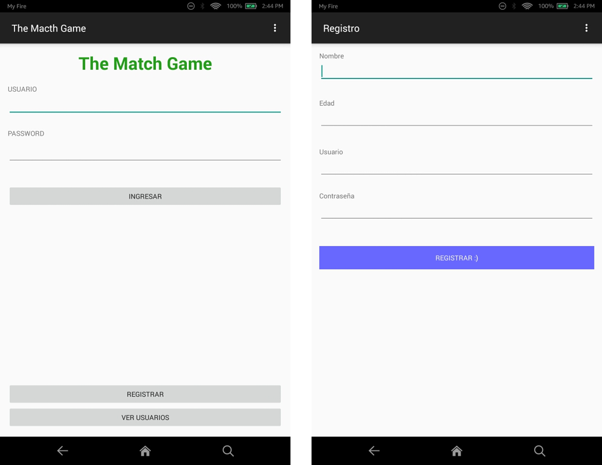
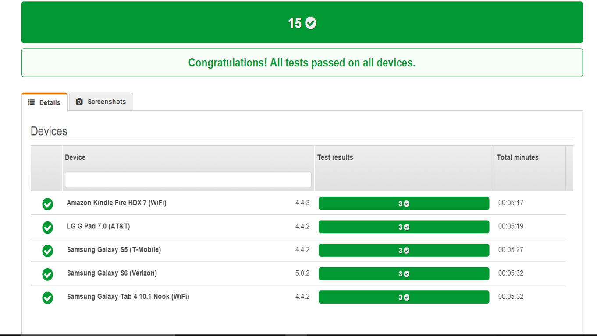
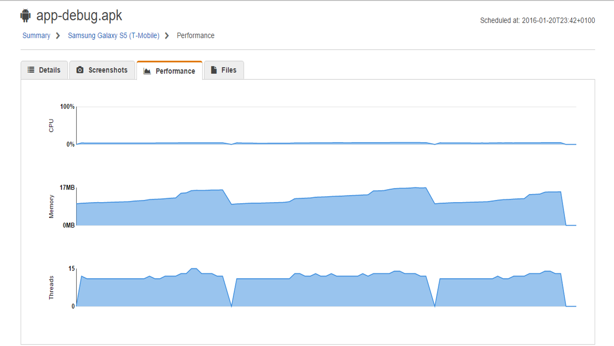

# The Match Game
Emision de Badges

##Introducción
Se desarrolló totalmente bajo Android, implementando un Webview para ejecutar las funciones remotas Javascript-xAPI, en el caso de este repositorio la funcion de javascript que invoca el xAPI se llama "sendBadges". 

La librería utilizadas para la establecer comunicación entre Android y Apache fue \textbf{Android Asynchronous Http Client}, esta se encarga de enviar y recibir arreglos de JSON entre la App de Android y el Servidor Apache


### Implementación de la Liberia Android Asynchronous Http Client
```java
	AsyncHttpClient client = new AsyncHttpClient();
	String url="http://192.168.1.100:8080/loginAndroidPHP/FetchUserData.php";
	
	RequestParams requestParams = new RequestParams();
	requestParams.add("username", et_login.getText().toString());
	requestParams.add("password", et_password.getText().toString());
	
	
	RequestHandle post= client.post(url, requestParams, new AsyncHttpResponseHandler() {
	String usuario= null;
	
	@Override
	public void onSuccess(int statusCode, Header[] headers, byte[] responseBody) {
	if(statusCode==200){
	try {
	JSONObject o = new JSONObject(new String(responseBody));
	usuario = o.getString("username");
	
	if(!TextUtils.isEmpty(usuario)){
	Aplicacion app = (Aplicacion) getApplicationContext();
	app.setUsuario(usuario);
	// segunda sg = new segunda();
	// sg.tv_nombre.setText(usuario);
	startActivity(new Intent(MainActivity.this, segunda.class));
	} else {
	Crouton.makeText(MainActivity.this,"Error de ingreso", Style.ALERT).show();
	}
	} catch (JSONException e) {
	e.printStackTrace();
	Crouton.makeText(MainActivity.this,"Error de ingreso", Style.ALERT).show();
	}
	}
	
	}
```	

	
### Implementación de lectura de URL y llamado de función remota JS

```java
	
			// ASIGNACION DE VARIABLE A WEBVIEW 
	wbXAPI = (WebView) findViewById(R.id.webView);
	
	wbXAPI.getSettings().setJavaScriptEnabled(true);
	wbXAPI.getSettings().getJavaScriptEnabled();
	wbXAPI.setWebChromeClient(new WebChromeClient());
	wbXAPI.setWebViewClient(new WebViewClient());
	wbXAPI.getSettings().setDomStorageEnabled(true);
	
		// Lectura de URL
	wbXAPI.loadUrl("http://192.168.1.100:8080/AndroidDB/badgeMobile.html");
		// Llamado de Funcion Remota Javascript 
	 wbXAPI.loadUrl("javascript:sendCalc('Parametros que se guardaran ene l Badge')");
	 	// Mensaje de Registro de Badge
	 Toast.makeText(getApplicationContext(), "Registro Exitoso", Toast.LENGTH_LONG).show();
		// Cambio a ventana de ganador
	 startActivity(new Intent(getBaseContext(), badgeEmitido.class));
```

#Sinopsis
La trama es el cálculo numérico de una operación matemática; en la entrada principal tiene 4 opciones a elegir Suma, Resta, Multiplicación y División, el usuario o estudiante debe elegir el reto, cada reto contara con 3 preguntas, si las 3 son respondidas entonces se emitirá un Badge, si erra en una respuesta deberá empezar de nuevo el reto. Dependiendo del tipo de operación que vaya a realizar el jugador emitira un Badge, si logra completar todas las operaciones tambien emitira un Badge que indicara el nivel completo del Juego.


Repositorio de Estandar de de emision de badges a traves de una sola plataforma mediante la combinancion de estandares, los principales para comunicación xAPI (ADL), Openbadges (Mozilla). A continuacion se mostraran tres carpetas en la que cada una tendra un ejemplo de comunicación y emision de badges a traves del estandar propuesto.



##Test Rendimiento de App Android (AWS Device Farm)
Uno de los desafios de una App Movil (Android) es que sea adaptable para diversos modelos de moviles debido rapido crecimiento y actualizaciones del OS Android, existen diversas API Android, suele ocurrir el caso en que una funcionalidad para una API no es compatible con otra, por ello es importante realizar un test con diversos dispositivos y verificar su rendimiento, para realizar la prueba de la App MatchCalc he utilizado la herramienta AWS Device Farm.






