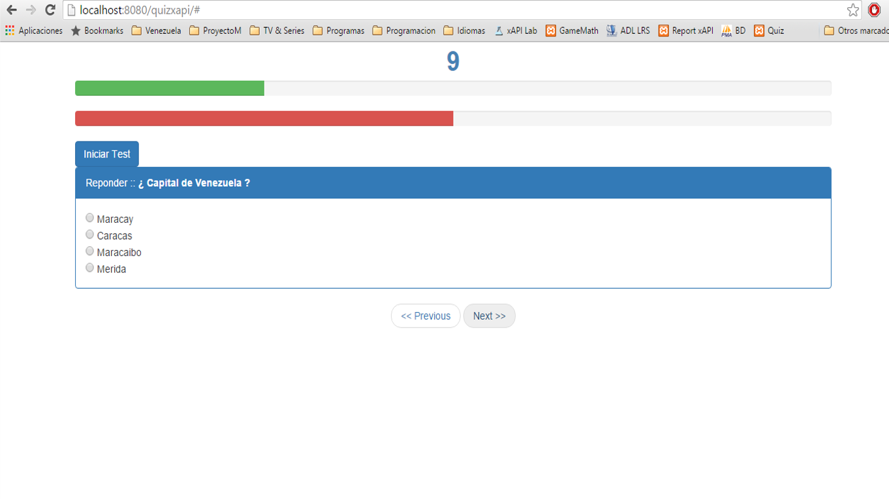

# The Quiz Game
Emision de Badges.

##Introducción
Es un juego desarrollado en HTML y Javascript, se basa en preguntas y respuestas, tiene determinado un número de preguntas, para la emision del Badge las respuestas correctas deben representar como minimo el 75%, para eliminar al jugador las respuestas incorrectas deben representar 50% de todas las respuestas.


# Desarrollo de Juego
Este pequeño juego como he mendionado anteriormente se basa en la Web, utilizando Bootstrap y Javascript como componentes principales para su desarrollo, utilizando funciones en Javascript logra conectarse al Modelo de Emision de Badges que he propuesto, el cual es el encargado de emitir el Badge a partir de las condiciones que se pronpongan en el Juego.

La compañia encargada del desarrollo del Juego debe proporcionar la imagen que se utilizara para emitir el Badge, dicha imagen debe estar en formato PNG y no pesar mas de 250 kb.


Repositorio de Estandar de de emision de badges a traves de una sola plataforma mediante la combinancion de estandares, los principales para comunicación xAPI (ADL), Openbadges (Mozilla). A continuacion se mostraran tres carpetas en la que cada una tendra un ejemplo de comunicación y emision de badges a traves del estandar propuesto.


```javascript
var contador = 0; // INICIAMOS CONTADOR EN 0
var q;

function reloj(){
	q  = setInterval(contar,1000); // CONTADOR POR INTERVALO DE SEGUNDOS
}


function contar(){
	contador++;
	document.getElementById("temporizador").innerHTML = contador;

	if(contador == 25){
		clearInterval(q);
		document.getElementById("temporizador").innerHTML = "Sorry budy, but try again.. !!";
		contador = 0;

		// Modal function Bootstrap
		$('#myModal').modal('show');
		// end function
	}

	}


var contNextQuestion = 0;
var contAciertos = 25;
var contInciertos = 50;
		$(document).ready(function(){
		    $("#testInit").click(function(){
		        $("#questiones").load("views/viewQuestion.php?contadorPreguntas="+contNextQuestion);
		        reloj();
		        contNextQuestion++;
		    });

		    $("#next").click(function(){

		    	if(contNextQuestion < 4){
		        $("#questiones").load("views/viewQuestion.php?contadorPreguntas="+contNextQuestion);
		        contNextQuestion++;
		        contador = 0;
			    } else {
			    		clearInterval(q);
			    		contador = "The Game is Finished";
			    		contNextQuestion++;
			    }

		        var a = document.formRequest.opcionRes.value; // obtengo valor del radio seleccionado en la respuesta
		        var respuestacorrecta = document.formRequest.respuestacorrecta.value; // obtengo el valor de la respuesta correcta

		        if(a == respuestacorrecta){  // condicional para comprobar la respuesta
		        		//document.getElementById('testoption').innerHTML = "correcto" + contNextQuestion;
		        	var bueno=	document.getElementById('progresobueno').style.width = contAciertos+"%";
		        		contAciertos = contAciertos + 25;
		        		if(contNextQuestion > 4 && contAciertos >= 75){ // condiciones superadas para emision de badge
		        			sendingResults('<div class="alert alert-success">You Win</div>');
		        			sendCalc('The Quiz Game', 'Results', 'Winner'); // envio de badge al servidor LRS
		        		}
		        } else {
		        		//document.getElementById('testoption').innerHTML = "inconrrecto";
		        	var malo=	document.getElementById('progresomalo').style.width = contInciertos+"%";
		        		contInciertos = contInciertos + 50;
		        		if(contInciertos > 100 ){
		        			sendingResults('<div class="alert alert-danger">You Lose</div>');
		        		}
		        }

		    });

		});


function sendingResults(id){
	clearInterval(q);
	document.getElementById("infoResults").innerHTML = id;
	$('#myModal').modal('show');
}

```


