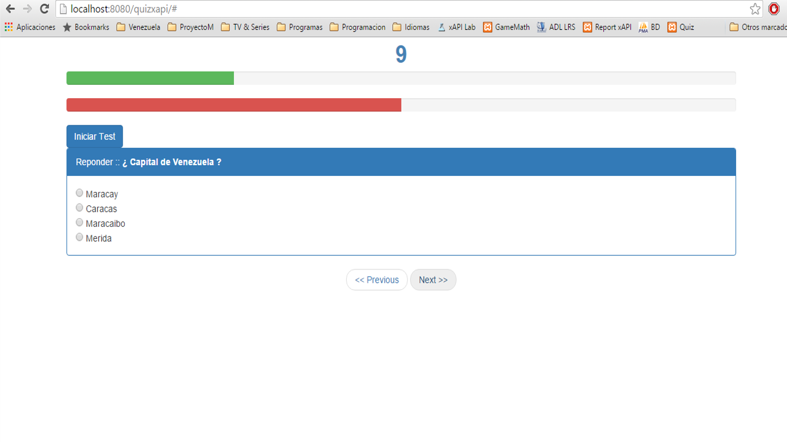

# The Quiz Game
Emision de Badges.

##Introducción
Es un juego desarrollado en HTML y Javascript, se basa en preguntas y respuestas, tiene determinado un número de preguntas, para la emision del Badge las respuestas correctas deben representar como minimo el 75%, para eliminar al jugador las respuestas incorrectas deben representar 50% de todas las respuestas.


# Desarrollo de Juego
Este pequeño juego como he mendionado anteriormente se basa en la Web, utilizando Bootstrap y Javascript como componentes principales para su desarrollo, utilizando funciones en Javascript logra conectarse al Modelo de Emision de Badges que he propuesto, el cual es el encargado de emitir el Badge a partir de las condiciones que se pronpongan en el Juego.

La compañia encargada del desarrollo del Juego debe proporcionar la imagen que se utilizara para emitir el Badge, dicha imagen debe estar en formato PNG y no pesar mas de 250 kb.


Repositorio de Estandar de de emision de badges a traves de una sola plataforma mediante la combinancion de estandares, los principales para comunicación xAPI (ADL), Openbadges (Mozilla). A continuacion se mostraran tres carpetas en la que cada una tendra un ejemplo de comunicación y emision de badges a traves del estandar propuesto.


```javascript


// *************************      Test Game xAPI        ************************* //

// Un pequeño ejemplo de condición de respuestas de un juego de Preguntas y Respuestas en HTML 
 if(a == respuestacorrecta){  // condicional para comprobar la respuesta
		        
	var bueno= document.getElementById('progresobueno').style.width = contAciertos+"%"; // barra de progreso de respuestas correctas
		contAciertos = contAciertos + 25;
			if(contNextQuestion > 4 && contAciertos >= 75){  // Condiciones superadas para emision de badge
				sendingResults('<div class="alert alert-success">You Win</div>'); // Declarando Ganador
				sendBadge('The Quiz Game', 'Results', 'Winner'); // Envio de badge al servidor LRS
			}
	        } else {
        var malo= document.getElementById('progresomalo').style.width = contInciertos+"%"; // barra de progreso de respuestas incorrectas
        		contInciertos = contInciertos + 50;
        		if(contInciertos > 100 ){
        			sendingResults('<div class="alert alert-danger">You Lose</div>'); // Declarando Perdedor
        		}
 }


// Como se puede observar en la función de envios de Badges, la cantidad de variables a enviar va a depender 
// de las variables que usted necesite para la emision del Badge, para una mejor descripcion por favor verificar el archivo functionXAPI.js
// en la funcion sendBadge observara un formato JSON el cual es el establecido para la emision del Badge. 

```


