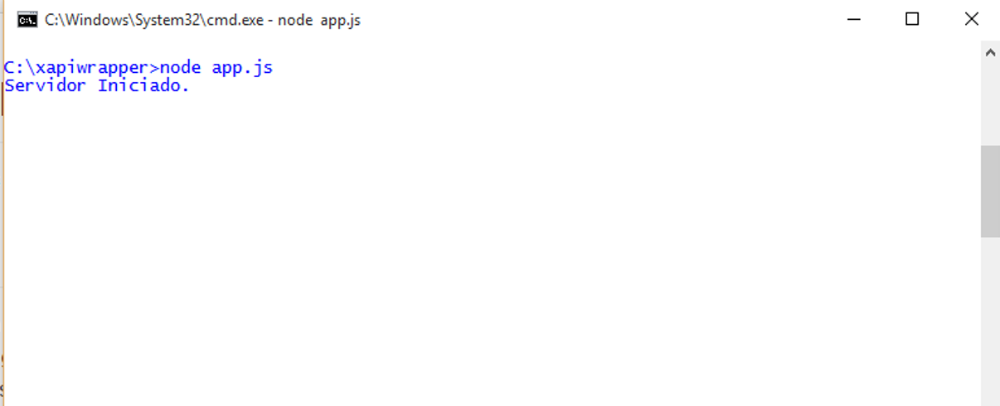

#Emision de Badges a traves de Juego desarrollado en Unity bajo el Lenguaje de Programación c#


Repositorio de Estandar de de emision de badges a traves de una sola plataforma mediante la combinación de estandares, los principales para comunicación xAPI (ADL), Openbadges (Mozilla). A continuacion se mostraran tres carpetas en la que cada una tendra un ejemplo de comunicación y emision de badges a traves del estandar propuesto.


##Comunicación Unity Servidor LRS
Para la comunicación desde c# en Unity, se establece a traves de la clase **WWW** desde donde se invoca la url de un Servicio Web, normalmente estos servicios no tienen una funcion autoejecutable de JS, por lo que se debe establecer un servidor de escucha, razon por la cual se ha utilizado la libreria nodejs express **xapiwrapper de ADL**, esta libreria permite realizar un servidor de escucha y podemos configurar el puerto de comunicación, ademas de esto, fue necesario añadirle otras funcionalidades como recepcion de get, y configuración de puerto. EL get es necesario para recibir los parametros o data de los usuarios los cuales se deben enviar desde el juego, el codigo se puede apreciar en app.js, aunque para la ejecucion completa del servidor es necesario la carpeta servernodejs, es necesario tener instalado el servicio nodejs.


###Servidor NODEJS (Asignación de Datos de acceso al Servidor LRS y aginación de puerto de comunicación).
```javascript
var http = require('http');
var url = require('url');

var adl = require('adl-xapiwrapper');
adl.debugLevel = 'info';
var myconfig = {
    "url":"http://52.88.101.103:8000/xAPI/",
    "auth":{
        "user":"match_game",
        "pass":"ruciomoro"
    }
};
var mylrs = new adl.XAPIWrapper(myconfig);


http.createServer(function(request, response) {

   var query = url.parse(request.url,true).query;
   var mbox = "mailto:"+query.mbox;
   var nameactor = query.nameactor;
  // response.writeHead(200, {'Content-Type': 'text/html'});
   //response.end(variableget);

   var stmt = {
            "actor" : {
                "mbox" : mbox, 
                "name": nameactor, 
                "objectType": "Agent"
            },
            "verb" : {
                "id" : "http://adlnet.gov/expapi/verbs/answered",
                      "display" : {
                        "en-US" : "answered"
                    }
            },

            "object" : {
                "id" : "http://adlnet.gov/expapi/activities/question", 
                "definition": {
                    "name": {
                        "en-US": "actividad"
                    },
                }
            }
        };


  mylrs.sendStatements(stmt, function (err, resp, bdy) {
    adl.log('info', resp.statusCode);
    adl.log('info', bdy);
});

}).listen(8888);
console.log("Servidor Iniciado.");

```




###Metodo de conexión y envios de datos del Badge al Servidor NODEJS
Este trozo de codigo se de colocar en la función c# que emitira el Badge, asignando por get los parametros que se desea enviar, es importante recalcar que estos parametros son la informarción que se almacenara en el Badge.
```cSharp
	// SE ENVIA POR GET TODOS LOS PARAMETROS RELACIONADOS CON EL BADGE
    string url = "http://localhost:8888/?mbox=ingfcoa@gmail.com&&nameactor=Freddy Coa";
			WWW www = new WWW(url);
			StartCoroutine(WaitForRequest(www));
```

###Instalación y Ejecución del Servidor servernodejs:
1. Instalar nodejs en el Servidor del Juego
2. Descargar la carpeta del servidor servernodejs
3. Abrir la terminal Windows, Mac o Linux (Recomiendo), ubicamos en la carpeta **cd path/servernodejs/**, una vez ubicado en la carpeta ejecutamos el 2do comando **node app.js** podrán apreciar en la terminal un mensaje "Servidor Iniciado".

