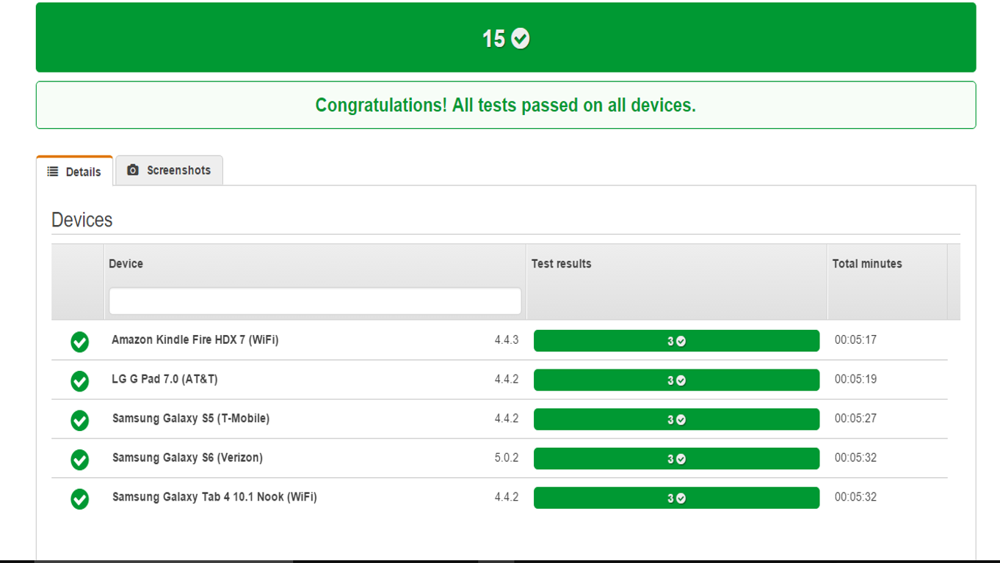
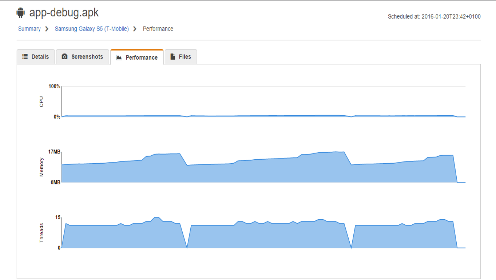

# The Match Game
Emision de Badges

##Introducción
Se desarrolló totalmente bajo Android, implementando un Webview para ejecutar las funciones remotas Javascript-xAPI, en el caso de este repositorio la funcion de javascript que invoca el xAPI se llama "sendBadges". 

La librería utilizadas para la establecer comunicación entre Android y Apache fue \textbf{Android Asynchronous Http Client}, esta se encarga de enviar y recibir arreglos de JSON entre la App de Android y el Servidor Apache


### Implementación de la Liberia Android Asynchronous Http Client
```java
	AsyncHttpClient client = new AsyncHttpClient();
	String url="http://192.168.1.100:8080/loginAndroidPHP/FetchUserData.php";
	
	RequestParams requestParams = new RequestParams();
	requestParams.add("username", et_login.getText().toString());
	requestParams.add("password", et_password.getText().toString());
	
	
	RequestHandle post= client.post(url, requestParams, new AsyncHttpResponseHandler() {
	String usuario= null;
	  
	@Override
	public void onSuccess(int statusCode, Header[] headers, byte[] responseBody) {
	if(statusCode==200){
	try {
	JSONObject o = new JSONObject(new String(responseBody));
	usuario = o.getString("username");
	
	if(!TextUtils.isEmpty(usuario)){
	Aplicacion app = (Aplicacion) getApplicationContext();
	app.setUsuario(usuario);
	// segunda sg = new segunda();
	// sg.tv_nombre.setText(usuario);
	startActivity(new Intent(MainActivity.this, segunda.class));
	} else {
	Crouton.makeText(MainActivity.this,"Error de ingreso", Style.ALERT).show();
	}
	} catch (JSONException e) {
	e.printStackTrace();
	Crouton.makeText(MainActivity.this,"Error de ingreso", Style.ALERT).show();
	}
	}
	
	}
```	

	
### Implementación de lectura de URL y llamado de función remota JS en Android

```java
	
			// ASIGNACION DE VARIABLE A WEBVIEW 
	wbXAPI = (WebView) findViewById(R.id.webView);
	
	wbXAPI.getSettings().setJavaScriptEnabled(true);
	wbXAPI.getSettings().getJavaScriptEnabled();
	wbXAPI.setWebChromeClient(new WebChromeClient());
	wbXAPI.setWebViewClient(new WebViewClient());
	wbXAPI.getSettings().setDomStorageEnabled(true);
	
		// Lectura de URL
	wbXAPI.loadUrl("http://192.168.1.100:8080/AndroidDB/badgeMobile.html");
		// Llamado de Funcion Remota Javascript 
	 wbXAPI.loadUrl("javascript:sendBadges('Parametros que se guardaran en el Badge')");
	 	// Mensaje de Registro de Badge
	 Toast.makeText(getApplicationContext(), "Registro Exitoso", Toast.LENGTH_LONG).show();
		// Cambio a ventana de ganador
	 startActivity(new Intent(getBaseContext(), badgeEmitido.class));
```

### Implementacion de la libreria Javascript ADL-xapiwrapper

* Establecemos una web (html, asp o php), y vamos hacer el llamado de la libreria xapiwrapper, configuración, funcion de envio de Badge.

```html
<html>
<head>
    <script src="controller/xapiwrapper.min.js"></script>
    <script src="controller/config.js"></script>
    <script src="controller/functions.js"></script>
</head>

<body>

Emision de Badges con llamada externa de Funcion Javascript SendBadges desde App-Android

</body>
</html>

```

* Se establece la configuracion del endpoint es la dirección del Servidor LRS http://52.88.101.103:8000/xAPI/ usuario y correo que utilizara la entidad desarrolladora del juego para la conexion con el Servidor LRS.

```javascript
function Config() {
	"use strict";
}

Config.endpoint = "http://192.168.1.231:8000/xapi/"; // URL del Servidor LRS
Config.user = "match_game"; // _Usuario Entidad del Juego
Config.password = "macthpassword"; // Contraseña de comunicación entidad del Juego
``` 

* Ya establecida la configuración de comunicación con el Servidor LRS procedemos a realizar la funcion Javascript que emitira el Badge

```javascript
// Dentro del Senbadge() asignas los parametros que necesite la entidad que contenga el Badge que desee emitir
function sendBadge(idCalc, resultCalc, exito) {

    var d = new Date();
    doConfig();

    // statement para lanzamiento 
        var stmt = {
    "actor": {
        "mbox": "mailto:fcoa@ucm.es",
        "name": "fredsom",
        "objectType": "Agent"
    },
    "verb": {
        "id": "http://xapi.sigescar.com.ve/verbs/calculo",
        "display": {
            "en-US": "Bagde"
        }
    },
    "object": {
        "id": "http://xapi.sigescar.com.ve/activities/sesion",
        "definition": {
            "name": {
                "en-US": idCalc
            },
            "description": {

	        "en-US": "Math Calcs",
	   
	        "time": {
                "hour": d.getHours(),
                "minutes": d.getMinutes(),
                "seconds": d.getSeconds()
                    },
                    
                "points": {
                "score": 0,
                "potition": 80
                    },
				
				"level": {
                "number": 0,
                "description" : "Maximo Nivel"
                    },
                
                "potition": {
                "number": 0,
                "description" : "potition is ..",
                "total" : 10
                    },
                
                "end": {
                "date": d.getDay() + "/" + d.getMonth() + "/" + d.getFullYear(),
                "description" : "Description end"
                    },
                
                "grade": {
                "number": 0,
                "description" : "Premio en Calculos Matematicos",
                "imagebadge" : "http://www.xapi.sigescar.com.ve/badge/584669.png"
                    }
            }
        },
        "objectType": "Activity"
    }
}; 

    // Envio statement a traves de la funcion sendStatement
     ADL.XAPIWrapper.sendStatement(stmt);
	
}
``` 


##Test Rendimiento de App Android (AWS Device Farm)
Uno de los desafios de una App Movil (Android) es que sea adaptable para diversos modelos de moviles debido rapido crecimiento y actualizaciones del OS Android, existen diversas API Android, suele ocurrir el caso en que una funcionalidad para una API no es compatible con otra, por ello es importante realizar un test con diversos dispositivos y verificar su rendimiento, para realizar la prueba de la App MatchCalc he utilizado la herramienta AWS Device Farm.






