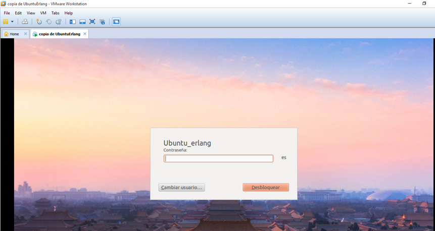

#Plataforma Badges
Basada en un entorno web, debido a su alta adaptabilidad, el usuario o estudiante con la utilización de su correo electrónico utilizado en cualquier videojuego podrá registrarse en dicha plataforma, ella es la encarga de extraer los datos del Servidor LRS, si el usuario o estudiante no ha obtenido ningún Badge, al intentar registrarse no podrá debido a que no se encuentra ninguna información de sus Badges, es importante mantener una sola cuenta de correo electrónico, ya que de ello dependerá la asociación de los Badges. En esta plataforma además se encuentran las librerías Open Badges que hacen posible la creación de Badge Digital.

